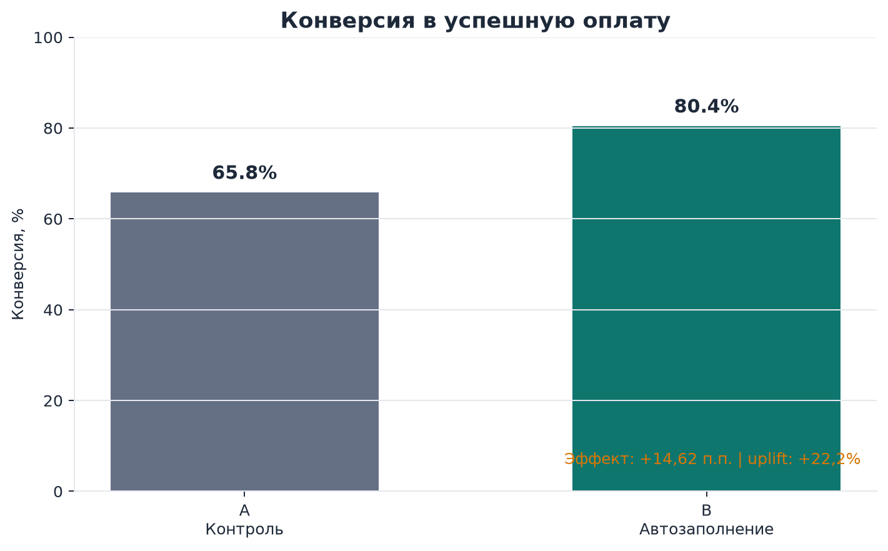
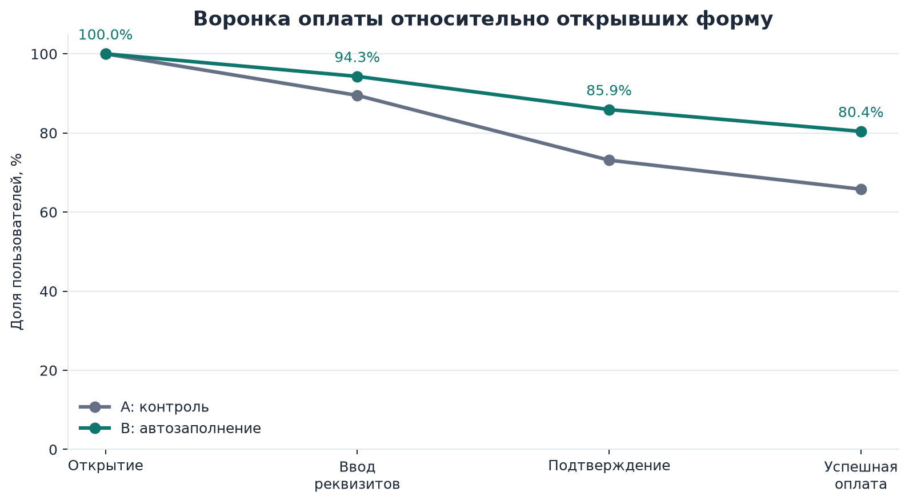
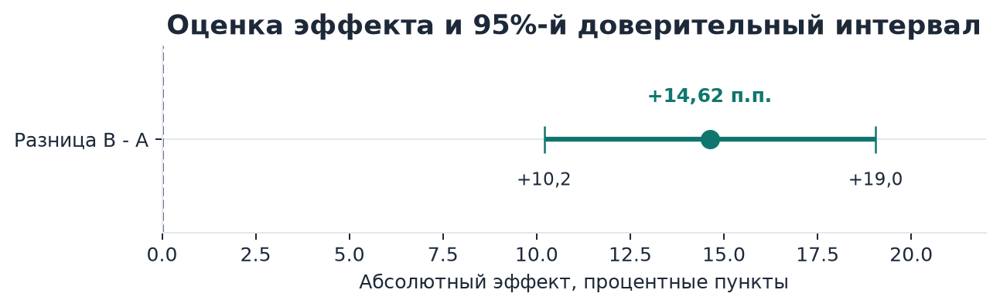
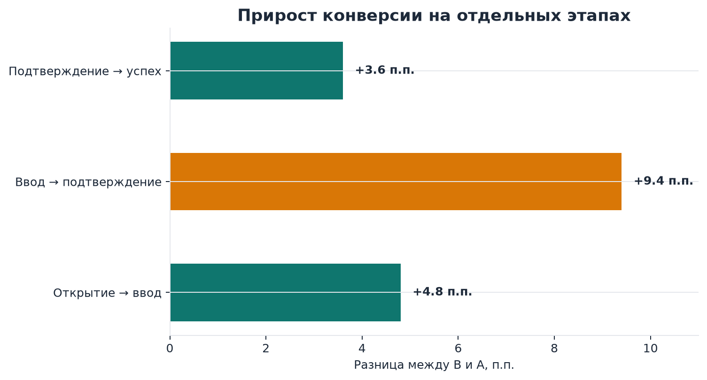

# A/B-тест формы оплаты ЖКХ

Учебный продуктовый кейс. Как автозаполнение реквизитов влияет на успешное завершение платежа.
Тестовое задание Т-Банк

## Коротко о результате

Новая форма оплаты показала статистически значимый положительный эффект:

| Метрика | Группа A | Группа B | Изменение |
| --- | ---: | ---: | ---: |
| Конверсия из открытия формы в успешную оплату | 65,78% | 80,40% | +14,62 п.п. |

Относительный uplift составил **22,2%**.

Статистическая проверка дала `z = 6,39` и `p-value = 8,52 × 10⁻¹¹`. При уровне значимости `α = 0,05` нулевая гипотеза отвергается.

**Рекомендация:** гипотеза подтверждается, новую форму можно рекомендовать к раскатке после дополнительной проверки стабильности эффекта на сегментах и в реальном продукте.

## Контекст и гипотеза

Пользователь оплачивает услуги ЖКХ через платёжную форму. В тестовой версии реквизиты пользователя заполняются автоматически.

**Гипотеза:** если сократить объём ручного ввода, пользователям будет проще пройти платёжную форму, поэтому конверсия из открытия формы в успешную оплату вырастет.

Обозначения эксперимента:

- **Группа A** - контрольная версия формы.
- **Группа B** - версия с автозаполнением реквизитов.

## Данные

В исходном Excel-файле два листа:

- `Пользователи` - `user_id`, группа эксперимента, возраст, город и тип устройства.
- `Платежи` - платёжные попытки и временные отметки прохождения шагов.

Размер исходных таблиц:

- 1 504 пользователя;
- 2 661 платёжная попытка;
- 1 501 пользователь с хотя бы одной попыткой оплаты.

### Проверка качества данных

Перед расчётом метрик были проверены пропуски, дубликаты, принадлежность пользователей к эксперименту и логика последовательности шагов.

В таблице платежей обнаружилась одна запись без `user_id`. Она была исключена, потому что такую попытку невозможно надёжно связать с пользователем и его экспериментальной группой.

```python
payments = payments[payments["user_id"].notna()].copy()
payments["user_id"] = payments["user_id"].astype(int)
```

Все оставшиеся платежи относятся к пользователям из таблицы `Пользователи`.

Проверка последовательности также не выявила нарушений:

```text
step2_entered без step1_opened:      0
step3_confirmed без step2_entered:   0
step4_success без step3_confirmed:   0
```

Один пользователь мог совершать несколько попыток: в среднем 1,77 попытки, максимум 4. Поэтому в анализе важно разделять уровень попытки и уровень пользователя и не считать каждую строку платежей независимым пользователем.

## Воронка

Воронка состоит из четырёх этапов:

```text
1. Открыл форму
2. Ввел свои данные
3. Подтвердил платеж
4. Оплата прошла 
```

Для каждого пользователя определялось, дошёл ли он до соответствующего этапа хотя бы в одной платёжной попытке. После этого данные объединялись с группой эксперимента, городом и типом устройства.

Рассчитывались следующие метрики:

- `conv_1_2` - конверсия из открытия формы во ввод реквизитов;
- `conv_2_3` - конверсия из ввода реквизитов в подтверждение;
- `conv_3_4` - конверсия из подтверждения в успешную оплату;
- `conv_1_4` - основная метрика, конверсия из открытия формы в успешную оплату.

### Конверсии по шагам

| Переход | Группа A | Группа B | Разница |
| --- | ---: | ---: | ---: |
| Открытие - ввод реквизитов | 89,5% | 94,3% | +4,8 п.п. |
| Ввод реквизитов - подтверждение | 81,7% | 91,1% | +9,4 п.п. |
| Подтверждение - успешная оплата | 90,0% | 93,6% | +3,6 п.п. |

Наибольшая разница наблюдается на переходе от ввода реквизитов к подтверждению. Это согласуется с логикой гипотезы: автозаполнение уменьшает трение именно на этапе работы с реквизитами.

## Статистическая проверка

Поскольку основная метрика бинарная, сравнивались конверсии двух независимых групп с помощью z-теста для двух пропорций.

### Гипотезы

- **H₀:** конверсия в группах A и B одинакова.
- **H₁:** конверсия в группе B выше, чем в группе A.
- Уровень значимости: `α = 0,05`.

Формула абсолютного эффекта:

```text
Δ = p_B - p_A = 0,8040 - 0,6578 = 0,1462
```

Результат теста:

```text
p_A       = 0,6577896
p_B       = 0,8040000
Δ         = 0,1462104
z         = 6,3859450
p-value   = 8,517 × 10⁻¹¹
```

95%-й доверительный интервал для разницы конверсий:

```text
[0,102; 0,190]
```

То есть реалистичный диапазон эффекта составляет примерно **от +10,2 до +19,0 процентного пункта**.

## Визуализация

В проекте построены два графика:

1. Сравнение итоговой конверсии групп A и B.
2. Сравнение всей воронки оплаты по этапам.

Визуализации помогают увидеть не только итоговый прирост, но и этап, на котором появляется основная разница между версиями формы.

### Графики









## Итоговый вывод

Тестовая версия формы с автозаполнением реквизитов показала более высокую конверсию в успешную оплату: `80,40%` против `65,78%` в контроле.

Разница составляет `+14,62 п.п.`, а доверительный интервал не пересекает нулевой эффект. Результат статистически значим и согласуется с продуктовой гипотезой: уменьшение ручного ввода помогает пользователям завершить оплату.

Перед полноценной раскаткой стоит дополнительно проверить:

- стабильность эффекта во времени;
- результаты по устройствам и городам;
- отсутствие ухудшения ключевых технических и финансовых метрик;
- корректность расчёта на уровне рандомизированного пользователя при повторных попытках оплаты.

## Инструменты

- Python
- pandas
- NumPy
- SciPy
- Matplotlib
- Excel

## Материалы

- [Ход работы с моим кодом и записями в PDF](./Аналитика%20A%3AB%20test.pdf)
* Проект выполнялся лично мною. Информацию скомпилировал и представил в ReadMe с помощью ИИ.
